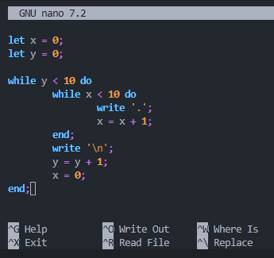

#  [SOARE](https://github.com/AntoineLandrieux/SOARE/) Language Support

>
> Language Support for syntax highlighting (in Notepad++, Nano, etc) helps developers quickly identify keywords, variables, data types, and other important elements within the source code. By applying different colors, reduces the chances of errors, and aids in understanding the structure of the code more effectively.
>

---

## ✅ Task List

- [X] Nano
- [x] Notepad++
- [ ] Vim
- [ ] Visual Studio Code

>
> 
>
> **Example**: nano
>

## 📖 Documentation

See [Soare Language Support Documentation](doc/documentation.md)

## 🤲 Contributing

The Soare Language Support source code is located in the Git repository at [github.com/AntoineLandrieux/SoareLanguageSupport](https://github.com/AntoineLandrieux/SoareLanguageSupport/).
Contributions are most welcome by forking the repository and sending a pull request.

## 📜 Credit

See **[AUTHORS file](AUTHORS)**

**Contributors :**

